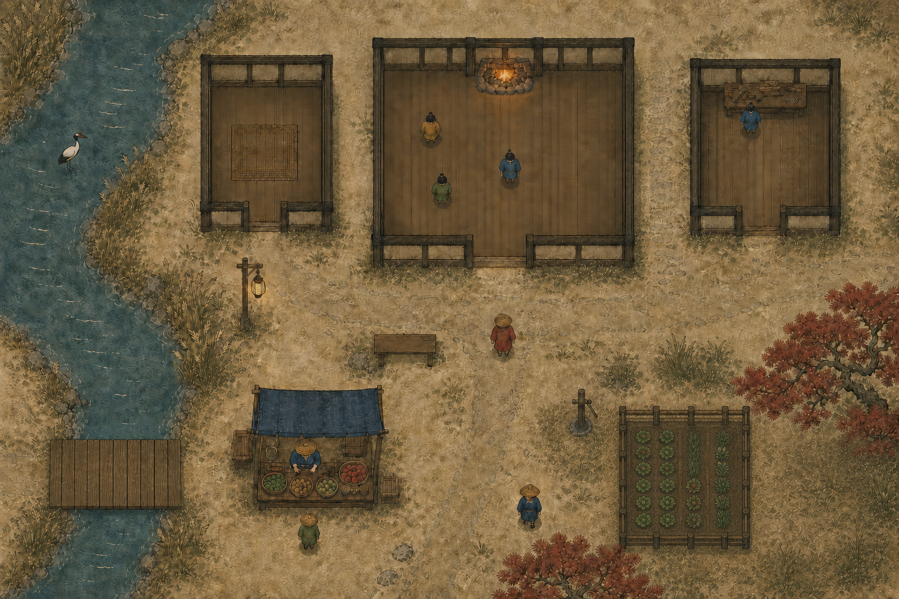
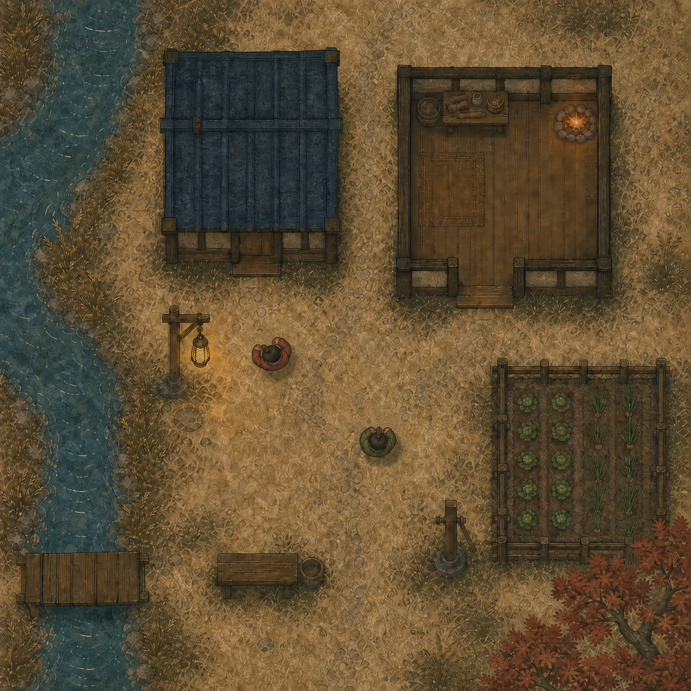

# Step 5.1: Art style

Status: functional baseline implemented. The owner approved Hearthside Ink on 2026-08-09, its flat tiled presentation on 2026-08-11, and the top-down-shooter character projection on 2026-08-12, and redirected the terrain boundaries to hand-tinted map seams with inked contours on 2026-08-14. [Step 5.3](5-3-visual-refinement.md) owns the remaining asset revisions and final visual sign-offs.

Part of [the plan](../README.md). This first signed part of build-order step 5 replaces step 3's placeholder tileset, preserves its renderer contract and collision overlay, and leaves the HUD and input to [step 5.2](5-2-hud-interaction-and-camera.md). [Step 5.3](5-3-visual-refinement.md) revises this visual baseline without changing those functional contracts. Its atlas art flows through the [step 5.0](5-0-atlas.md) pipeline. The approved reference is [Hearthside Ink](../art/hearthside-ink-approval.png).

The implementation descriptions below record the current 5.1 baseline. When a 5.3 unit lands, its replacement contract becomes authoritative and the corresponding 5.0 atlas facts change in the same change set.

## The design: Hearthside Ink

Hearthside Ink is a peaceful domestic sibling to Estuary Ink: natural ink wash, flatter woodblock value grouping, parchment ground, quiet water and reeds, warm timber, and deliberate small marks. The game uses an exact 90 degree top-down-shooter plan view. Each tile is one village cell, with no perspective, isometric face, or separate interiors.

Tiles are high-resolution flat shapes, not pixel art. The approval fixes palette, material, value grouping, and readability, but not a canonical layout, building placement, or scenery placement. Every seed remains a valid [village.md](../village.md) layout.

The supplemental [Hearthside Ink material board](../art/hearthside-ink-material-board.png) fixes the shared material language for production art. It is a landscape reference only, not a source for runtime extraction. It shows one overhead character, one domestic prop, pine and crate materials, packed earth beside a pale path, ground, floor, wall, contact shadow, glow, and restrained ink marks.

The board establishes a balanced midpoint between the current characters and props: flatter and quieter than the props, with more material definition than tint-only terrain. Each object uses three to five broad value groups. At 128 displayed pixels per cell, silhouettes use two-pixel ink and internal marks use one-pixel ink. Artwork uses the fixed Hearthside palette, 12 and 24 percent dark steps toward `backdrop`, and a 10 percent light step toward `bone`. Use low-frequency painted grain, controlled form shading, solid opaque materials, intentional alpha apertures where a structure needs open space, one-pixel antialiased edges, and no baked cast shadows or perspective.

### Palette

The renderer exports one fixed `HEARTHSIDE_STYLE` palette for artwork, shaders, thumbnails, and tests.

| Key | Value | Name | Use |
| --- | --- | --- | --- |
| backdrop | #101816 | night ink | canvas surround, deepest unlit marks |
| parchment | #cfc5a9 | parchment | paper base and dry paths |
| bone | #efe7d3 | bone | pale marks, sprite edge lights, sparse highlights |
| ink | #6f6757 | dilute ink | drawn outlines, wash marks, unlit details |
| reed | #a9ae8a | reed | open ground and reed-flat grouping |
| silt | #bfa072 | silt | field soil, banks, and dry earth |
| water | #5a7680 | slack water | channels and water marks |
| pine | #4f6a4b | pine | trees, garden growth, and dark vegetation |
| indigo | #27436b | charcoal indigo | cool architectural shadow and stable NPC accents |
| cinnabar | #b0402e | cinnabar | restrained visitor distinction and active domestic accents |
| gilt | #d9a441 | gilt | hearth, lantern, and tiny warm points only |
| violet | #6b5d72 | ash violet | dusk shadow and weathered secondary marks |
| timber | #8a6246 | cedar timber | building bands, furniture, fences, and warm woodblock grouping |

Use broad value groups before small ink details. Cinnabar identifies `player_0`, the visitor, without creating a side-coloured board. Select each NPC's muted reed, pine, indigo, violet, parchment, and timber palette deterministically from its player id, never arrival order or replay history.

### Terrain and buildings

Author Terrain art at 128 px per cell and draw it at the renderer's 16-unit cell. Other atlas groups retain their listed frame sizes. Map x and y directly to the renderer's world axes.

Paint the engine-authored `overlay_static` grid as continuous material surfaces. The gameplay and collision grid stays authoritative. Natural visual boundaries may move by at most 0.6 cell perpendicular to the source edges they are drawn from. Two opposing boundaries are drawn from their own source edges and nothing pulls them together, so a band keeps the width the grid gave it. A drawn boundary may cross cell centres, so something standing near a boundary can visually stand on the neighboring material; collision and recorded ground stay exact.

Each material keeps several deterministic texture variants, composed into one repeating four-cell pattern. Natural surfaces use a half-cell offset grain pass so no blank cell grid shows. The road and path pilot use continuous authored texture and omit that second pass. Before contouring, a renderer-only substrate pass propagates the nearest natural ground, field, or reed material through road and path cells, with stable ties. A pure shared-contour pass traces every resulting material adjacency once and gives both neighboring materials the same curve in reverse. Land, water, road, and path use one curve-profile vocabulary, every field of it a distance in cells: sample spacing, corner radius, and noise octaves of wavelength and amplitude. Natural surfaces draw as anti-aliased vector polygons filled with their patterns, with no sparse halo layers and no stencil clip masks. Ground covers the complete map beneath them.

Road and path become inset textured routes above that substrate.

- The road pilot uses four seamless direction-neutral packed-earth frames: warm silt mixed 20 percent toward timber, broad compressed-earth washes, sparse broken flecks, three to five value bands, and no ruts, wood grain, stones, grass, borders, gradients, or focal object. The road follows deterministic column-run medians at 2.10 cells wide, may narrow no further than 1.60 cells, and is fully opaque.
- Each pale parchment path is a 0.70-cell fully opaque stroke and shares the road frames for this pilot.
- Each route surface uses ten same-pattern layers to form its configured true linear edge fade from inside to outside the nominal route.
- All route material and fade layers cut away beneath exact bridge decks. Axis decks use butt-capped water-portal spans, so visible plank texture overlaps each long deck edge by 0.025 cell to absorb registration and raster seams while route cutouts, shadows, and portal length remain exact. Bridge planks sit over water with a backdrop-tinted 0.25 shadow offset 0.06 cell south.
- Natural boundaries take the seam treatments: a darkened pooling band inside each field, reed, and water component, a broken grain-textured ink line with a faint bleed along every natural adjacency, and thin ink hatch lines offset onto the water, all cut away under roads, paths, and decks and tapered beside bridge portals.
- Architectural floor, doorway, and wall boundaries stay grid-aligned for the later Roofs unit.

Floor, wall, and doorway are ground classes. Paint each building from the grid: floor within, wall around its perimeter, and a two-cell opening on one side. A building record remains semantic only: id, type, and origin cell. It owns no collision, use selection, or prop-state observation. Hearths and repair benches are separate props on floor ground. Repeat wall tiles in the upper terrain layer as shallow dark eave and wall bands above occupants.

Each semantic building has a simple roof container aligned to its rect. A roof is opaque when empty and clears when anyone occupies its semantic rect. Occupancy fixes target alpha; the between-tick clock eases to it. Seeking, repeating a frame, mounting, or resizing snaps to it, so no forward-only roof history exists. Homes contain only floor treatment, the inn contains its hearth, and the repair shed contains its repair bench.

### Scene and motion

Keep step 3's shared tile-map pipeline. Build static terrain, upper walls, semantic roofs, scenery, and permanent prop bases once at mount from the recording header's layout. Never rebuild them on a tick update or seek.

Reconcile characters, prop-state treatments, roof alpha, the night grade, emissives, and crane dressing by stable id. The shared Pixi ticker smooths position, heading, walk frames, sustained effects, and crane motion between recorded ticks.

Resolve state treatments once per recorded tick. Between ticks, transform the cast and sustained effects without rebuilding art, and move collision bodies with their art. `presentation.json` owns the natural one-second transition. Paced hosts scale it to replay or watch cadence. An unpaced human session measures the gap between states, caps it at the natural duration, and passes no cadence. Keep the frame loop briefly alive after settling, reuse masks, and load textures only through the renderer-local manifest.

Draw world layers in this order:

1. Night-ink surround, then natural terrain: continuous surfaces, their seam treatments, reed marks, and inset routes.
2. The authored composite, drawn in this order and covered as a whole by the authored-art grade:
   1. Lower architecture: exact floors, doorways, walls, bridge shadows, and bridge planks.
   2. Scenery.
   3. Prop contact shadows.
   4. Prop stills and foundations.
   5. Character shadows and characters.
   6. Upper walls and semantic roofs.
   7. Monument uppers and sustained effects.
3. The night grade, which covers steps 1 and 2 together so terrain and authored art darken as one.
4. Emissives, including lantern and hearth warmth.
5. The prop interaction highlight.
6. Nameplates, expression chips, and speech bubbles.
7. Collision overlay, always above art and never graded.

Natural terrain keeps its daytime colour through the authored grade, so generated artwork moves toward the terrain rather than both drifting together. Everything from step 4 onward sits outside both grades, which makes "post-grade" structural rather than a rule to remember. HUD and interaction are step 5.2 work and are never colour-graded.

### Characters, props, and dressing

Build characters from shared north-facing grayscale-alpha masks in a conventional top-down-shooter projection. The camera looks straight down onto the head, shoulders, torso, arms, and partly occluded lower body. A peaceful forward-arm pose makes north readable without a weapon. Rotate the complete assembled sprite around its centre to the exact recorded heading. A rest frame and short walk cycle advance from player id, tick, and movement state without changing that projection. Render a readable fitted-view shadow and direction mark. Select tint combinations and optional shared clothing details with a stable player-id hash. Give `player_0` a small cinnabar hood tie and retain the villagers' warm materials. The owner approved [the top-down shooter direction](../art/top-down-shooter-direction.png).

Every ordinary catalog state has one distinct complete north-facing still across its catalog footprint, turned to its facing. The lantern post and roadside shrine are symmetric and always draw fixed north, ignoring their recorded facing. Each ordinary prop uses a 384 by 256 runtime canvas that centers that footprint with at least two transparent pixels at its edge.

The canvas usable area is 380 by 252 px, which at the 0.14 default scale carries at most 3.36 by 2.24 cells. The board fits the canvas at the default scale, so its 0.28 override is interim: re-author `board/none.png` at 229 by 229 px and delete the override to restore the full 114 pixels per cell. The shrine and the plot do not fit at 0.14, so their overrides are permanent until an atlas re-cut: re-author targets at their new scales, shrine 240 by 240 px at 0.20 (80 px per cell) and plot 377 by 188 px at 0.17 (94 px per cell). A 512 by 512 props cell would hold a 3 by 3 shrine and a 4 by 2 plot at 114 pixels per cell with no overrides; that atlas re-cut is deliberately not part of this change. The shrine's incense effect does not scale with the prop, so the smoke reads slightly smaller over the bigger shrine; that is a re-author concern, not a renderer one.

The dedicated monument atlas is the sole authority for the fixed-north pump and both bell parts. Its 768 by 512 masters are tightly authored around their collision registration, never by enlarging legacy transparent bounds. `presentation.props.monumentByType` stores each type's texture-density divisor and the absolute source-pixel anchor for each role. The renderer divides the configured pump scale by 4 and the bell scale by 8, then places that source anchor at the collision centre. The pump still anchor is `(344, 384)`. The bell upper and foundation anchors are `(384, 480)` and `(384, 256)`. Both atlases leave unnamed trailing cells transparent.

The pump is a fixed north-facing monument: its circular footing is mechanically registered to the centered 1.0-cell collision circle while the mechanism may extend north beyond it. The bell has a state-independent circular stone foundation below characters and a fixed-north upper assembly above them: a rectangular pair of parallel posts rooted at opposite ends of the foundation diameter, joined by a crossbeam, with the bell in true transparent open space.

The configured prop scale defaults to 0.14, overrides bell to 0.36 for both art parts, overrides pump to 0.33, and overrides shrine to 0.20, board to 0.28, and plot to 0.17, while bell collision remains a 1.0-cell circle. Drive the result only from prop id, type, state, facing, and tick.

| Prop | Still treatment |
| --- | --- |
| Market stall | `open` shows a raised awning, displayed goods, and a pale counter; `closed` has a lowered shutter and cleared counter. |
| Lantern post | `lit` has a gilt core and small post-grade pool; `unlit` has a dark empty lantern. The current flicker and glow pool hang from the lantern's `(0, -70)` effect anchor on its 384-by-256 prop canvas. [Step 5.3 unit 3](5-3-visual-refinement.md#3-ordinary-props-and-a-dedicated-lantern-page) replaces this canvas and registration while preserving the cell footprint. Draws fixed north, ignoring facing. |
| Bench | `occupied` has a distinct laid cushion or folded wrap; `empty` leaves the bare slats readable. |
| Roadside shrine | `tended` has a fresh paper offering and incense bowl; `untended` has only the weathered shrine under its roof. Draws fixed north, ignoring facing. |
| Notice board | Its single `none` state is a fixed readable board with pale posted notices. |
| Garden plot | `tended` has ordered dark furrows and young green rows; `overgrown` has irregular pine-green growth that does not hide the fence. |
| Inn hearth | `lit` has a gilt-and-cinnabar coal core; `unlit` has cool ash and stacked dark wood. |
| Repair bench | `busy` has a laid-out tool and bright workpiece; `idle` has a cleared top and stored tools. |
| Well pump | `flowing` shows a visible pale water stream and wet basin mark; `idle` a dry basin and upright handle. Registry: idle alpha bounds `x=256..512`, `y=32..480`; flowing `x=256..508`, `y=32..480`; source anchor `(344, 384)`, scale divisor 4; configured `(31, -61)` effect anchor in the centered 384 by 256 prop coordinate system, multiplied only by the configured pump scale; spout stays registered at `(468, 140)` at 4x master density without another renderer offset. |
| Beacon bell | `ringing` tilts the bell and exposes the clapper; `silent` hangs plumb, with no triangular frame and true alpha around the bell. Registry: upper alpha bounds `x=192..576`, `y=24..488`, source anchor `(384, 480)`; foundation bounds `x=192..576`, `y=80..424`, source anchor `(384, 256)`; scale divisor 8. [Step 5.3 unit 6](5-3-visual-refinement.md#6-monument-and-effect-completion) owns both remaining approval gates. |

Animate only lantern flicker, hearth fire, shrine incense, pump water, and bell swing. Each animation is a seek-safe function of fractional playback tick, prop id, current state, and a stable hash phase. A new prop type needs no renderer change only when it reuses a placement token, art treatment, and transition mechanism.

White cranes are renderer dressing, not layout or game data. Derive count, start, route, and frame from static-layout key and tick. They have no cell, footprint, collision, or perception effect. Draw them north-facing and rotate them to the route tangent.

### Day phase

The current baseline runs two pure-colour grades. [Step 5.3 unit 1](5-3-visual-refinement.md#1-direct-colour-terrain-and-no-daytime-authored-grade) replaces the always-on authored grade with approved direct-colour assets and retains the night grade.

The authored-art grade is always on. It pulls generated objects and architecture toward the quieter terrain palette by desaturating, easing contrast so ink edges lift off pure black, and mixing a little parchment. Natural terrain and routes stay out of it and remain the daytime reference.

The night grade is the only phase-driven one. With `daynight`, the exact `night` phase attaches it over terrain and authored art together; it switches at presentation of the target scene, with no fade. Dawn, morning, midday, and evening carry no grade of their own, and with daynight off `day` is likewise neutral. Emissives render after both grades, so lantern and hearth warmth stays clean at night. The collision overlay, the prop highlight, and the HUD remain ungraded.

The cost ceiling is one viewport-clipped filter pass outside night and two during it.

### Assets and thumbnail

The local manifest is the only asset catalog. Keep only the high-resolution originals used by the approved art in `environments/three_branches/renderer/assets/source-art/`. Keep optimised compiled files in `environments/three_branches/renderer/assets/`. Loose per-frame files under `assets/<group>/` are the editable truth; [step 5.0](5-0-atlas.md) compiles them into the atlas pages, and both are committed. Use grayscale-alpha masks for tintable textures and full-colour raster art only where tinting cannot express the treatment.

`environments/three_branches/renderer/assets/presentation.json`, validated by `presentation.ts`, owns the palette, ground variants, land, water, road, and path curve profiles, seam treatments (pooling, ink, water hatching), reed marks, inset route and deck geometry, roof fade, post effects (the authored grade, the night grade, and the prop contact shadow), character treatments, prop and scenery scales, monument texture-density divisors and source-pixel anchors, prop effects, and crane dressing. `generation.json` remains generation-only, so visual calibration cannot alter seeded layouts.

`renderer/assets.ts` owns the catalog and runtime loader. Its seven atlas entries record each source and compiled file, dimensions, tintability, consumer, and sprite-sheet frame grid. The runtime loader resolves only pages with shipped consumers: terrain, props, monuments, buildings, scenery, the four character layers, and effects. Edit art by changing loose frames and running the step 5.0 pack command, never by hand-editing an atlas page.

| Group | Compiled dimensions | Contents |
| --- | --- | --- |
| Terrain | 128 px cells on one 1024 by 1024 atlas page | A few fill variants for each ground class, retained compatibility masks, the wall tiles' upper-layer repaint, and bridge plank tiles |
| Buildings | 64 px cells | Semantic roof tiles for the home, the inn, and the repair shed |
| Props | 384 by 256 cells on one 2304 by 1536 atlas page | Current baseline: fifteen complete full-colour ordinary prop stills, with transparent cells 15 through 35. Step 5.3 unit 3 extracts the two lantern frames. |
| Monuments | 768 by 512 cells on one 2304 by 1024 atlas page | The sole fixed-north pump stills and both bell parts, tightly authored around their configured source-pixel anchors and scale divisors |
| Scenery | 64 px cells | Current baseline: three red pine variants and the market crate. Step 5.3 unit 2 replaces these with six split base-and-canopy variants and preserves the collision contract. |
| Characters | 192 by 192 frames | Shared rotatable directly overhead masks for body, clothing, and details, with rest and walk frames, plus shadow and direction marks |
| Effects and dressing | 64 by 64 through 192 by 128 | Glow, flame, smoke, pump water, bell lines, and two white crane poses |

The separate 320 by 180 thumbnail is a final Hearthside Ink image, not a screenshot requirement or map claim. It shows night ink around a parchment fragment: a slack-water branch, low crossing, one home and garden, warm lantern light, and a cinnabar visitor.

### Collision truth

[ruleset.md](../ruleset.md) fixes impassable ground, catalog collision shapes, counts, states, transitions, and prop reach. The collision overlay remains exact and authoritative. Natural surface contours may move by at most 0.6 cell perpendicular to the source edge; they may cross cell centres. Walls, doorways, catalog shapes, the collision grid, generation, and recordings remain exact. Water and walls read solid, doorway ground open, and round catalog shapes read round, so walkers visibly slide around the pump, hearth, bell, lantern, and pine. The pump and bell use a 1.0-cell centered collision diameter inside their one-cell placement footprints. Their upper mechanisms, shadows, glow, smoke, and other non-solid effects may extend outside that shape. Art needing another extent changes the ground table or catalog and its generator, fixture, overlay, and tests together.

## Correctness, review, and configuration

The owner judges the rendered result through `npm run play -- three_branches watch --seed N` with the collision overlay. Terrain review captures the fixture and seeds 0, 17, and 37 at fitted, mid, and close fixed scales, plus one close collision-on view for each layout, for 16 PNGs total. Any temporary capture harness is removed after review. Each visual step below ends with that review, and its sign-off and date are recorded in place. No review tooling is added.

## Foundation

Status: complete.

The common layer under every visual step. It has no owner gate: the step 3 solid-colour drawing still renders until art lands, so every existing probe and journey keeps its meaning.

- `presentation.json` holds `palette` (the 13 keys), `transition` (natural and settle-grace durations), `terrain` (fills, contour calibration, seam treatments, reed marks, planks, upper wall), `roofs` (clear alpha, fade duration, and role-keyed frame records naming each building's corner, edge, ridge, and fills), `postEffects` (`authoredGrade`, `nightGrade`, and `propContactShadow`), `characters` (clothing tints, details, walk, visitor), `props` (0.14 default still scale, bell, pump, shrine, board, and plot scale overrides, the canonical 384 by 256 effect offsets including the lantern's raised `(0, -70)` light anchor, and monument density divisors with source-pixel anchors), `scenery` (0.25 default sprite scale with crates at 0.30, multiplied by each pine's recorded size), `propEffects` (lantern, hearth, shrine, pump, bell), `emissives`, and `cranes`.
- Each grade carries brightness, contrast, saturation, a palette tint, and a tint mix. Brightness and contrast must be above zero and at most two, saturation zero through two, and tint mix zero through one. The contact shadow carries a palette tint, an opacity, width and height factors above zero and at most two, and a southward offset of zero through a quarter cell.
- `presentation.ts` validates it in the `overlay.ts` style, cross-checks every frame name against the manifest and every tint against the palette, and exports `HEARTHSIDE_STYLE`. The step 3 canvas and camera numbers stay in TypeScript, and the provisional palette becomes a diagnostic palette kept for chrome, the collision overlay, and the pre-asset fallback.
- `tint.ts` maps manifest frame grids to rectangles and bakes tinted grayscale masks for the tiled ground in a browser-only canvas, cached per atlas, frame, and tint. Sprites elsewhere tint directly.
- `post-effects.ts` folds one grade into a row-major five-by-four matrix: saturation around luminance, contrast around mid grey, brightness, then the tint mix. Nothing is clamped on the processor, since the framebuffer performs the final clamp, and the identity alpha row keeps transparent apertures crisp.
- `world-stack.ts` owns the world containers and both retained filters. The authored filter stays attached to the authored composite. The night filter is retained across the whole mount and attached to the shared parent of terrain and authored art only during the night phase, never rebuilt or faded. Both filters inherit render-target resolution and antialiasing, add no padding, and clip to the viewport, so a pass costs one screen-sized texture at any zoom.
- `map-layer.ts` returns a `MapLayerView` for both loaded and fallback art: separate natural and architecture roots, the map span, and an idempotent `destroy()`. The view exclusively owns both roots and their tiled-ground, graphics, and mask resources. Art replacement builds the next views off-tree, attaches both replacements only after construction succeeds, then destroys the previous view once; a failure destroys only the incomplete replacement.
- `props-layer.ts` draws contact shadows into a world-space layer rather than inside the rotating prop roots. Each shadow is sized from the prop's unrotated footprint, keeps the fixed-monument collision scaling, rotates by the prop's visual facing, and sits at the collision centre plus the configured southward offset, so the offset never turns with the prop. The interaction highlight moves to its own post-grade layer.
- `loadArt()` runs after setup: it resolves the current runtime pages, validates and slices their frames, bakes the tinted tileset, installs terrain and character art, sets the `threeBranchesAssets` probe to ready, and re-renders. The solid-colour drawing remains the pre-load and failure fallback.

`overlay.ts`, `collision.ts`, `collision-layer.ts`, `chrome.ts`, and `camera.ts` do not change. Tests cover configuration validation, the 13 fixed hexes, and the paced and unpaced duration rules.

The foundation's successful art load swaps in the configured tinted terrain fills. Successful prop-art installation reapplies configured foundation and still scales, plus retained scenery-art scales, only after full art preflight succeeds. The Terrain step owns fill variation, contour composition, shoreline, bridge overlays, and upper-wall artwork.

## Terrain

`terrain-contours.ts` and `terrain-routes.ts` orchestrate the `terrain-contour-*.ts` and `terrain-route-*.ts` pipeline families. Alongside `terrain-curves.ts`, `terrain-art.ts`, and `map-layer.ts`, they land the retained terrain: pattern-filled vector surfaces, seam treatments, inset routes, component decks, and upper wall bands. `terrain-helpers.ts` holds terrain-specific shared helpers. `types.ts` owns the public terrain data contracts, while pipeline modules keep the working types needed across stage boundaries. Generic hash primitives and the generic distance helper live in `frontend/src/renderers/base/math.ts`.

### Surfaces

- The full ground base covers every cell.
- A nearest-natural propagation fills road and path cells with renderer-only ground, field, or reed substrate before contours build. A second pass normalizes the visual grid so no two natural materials meet at a corner alone: each diagonal-only touch rewrites one of the two cells that block it, each cell at most once, leaving cells that carry a structure or a bridge alone. Cardinal adjacency alone then decides every region, so contours never meet an ambiguous crossing.
- Each material composes its fill variants into one repeating four-cell pattern canvas with a half-cell offset grain pass, then draws as anti-aliased component polygons filled with that pattern. Water and bridge share one visual surface; exact structure tiles sit above the natural layers.

### Contours

- One pure half-edge graph includes the fixed map exterior and preserves every adjacency as one shared curve.
- A chain covers that adjacency whole, from one junction to the next. Both chain ends are locked, so a chain cut anywhere else freezes the curve onto a raw cell corner and freezes its direction there; a boundary cut once per step is frozen into a staircase that no smoothing can lift.
- Components retain their outer ring and directly owned holes; islands remain separate components without containment metadata.
- Before shaping, each chain derives its reference polyline: the raw boundary itself, with a vertex at every raw corner and lock boundary. Nothing is withheld or simplified, so a reference chord is exactly its raw arc and one raw offset scale serves the whole pipeline. Lifting a boundary off the grid is left entirely to shaping, the only stage that moves a point.
- Every reference traces its own raw edges, so the two banks of a thin band keep the raw width between them. A closed reference keeps a vertex at raw offset zero so downstream seam interpolation stays valid.
- Shaping runs per chain on the reference: a three-point corner kernel smooths the resampled polyline, then summed noise octaves displace free points along the local normal.
- An octave amplitude is the distance a boundary usually moves, not a peak it reaches on a handful of samples, so the noise field carries its own deviation and the configured number is the one drawn. That distance keeps a bank from reading as the ruled chords its reference is built from.
- Nothing smooths the noise, since it is laid on after the corner kernel. A band draws every bend it carries, so its wavelength must stay several times the corner radius; a short band turns an elbow on every half period, and a boundary that elbows every couple of cells reads as terraced rather than drawn.
- The corner radius is a distance too: the kernel spreads a sample's influence the way diffusion spreads heat, rounding to `spacing * sqrt(passes / 2)`. The passes derive from the radius asked for, so corner shape no longer changes when sample spacing moves. The radius must clear the staircase corners it smooths; 0.8 cell leaves a quarter to a third of the turns past 45 degrees that half a cell does, at three fifths of the turning per cell.
- Land uses 0.25-cell samples, a 0.8-cell corner radius, and octaves of 0.20 cell at nine cells and 0.14 at 4.5. Water uses 0.20-cell samples, the same 0.8-cell radius, and octaves of 0.22 at eleven cells and 0.15 at five. Closed chains cap their effective passes by sample count so small ponds keep their shape.
- Map edges, structures, bridge entrances, and 0.15 cell of tangent on each side of them stay locked. That tangent holds three chains leaving one junction node in consistent directions and freezes the first corner past the node, so it is kept only as long as needed.
- One displacement bound holds both stages rather than a correction applied after them: a sample may leave the reference by at most the 0.6-cell deviation cap, and never by more than its arc distance to the nearest lock, so the freedom a curve carries away from a junction opens along the boundary rather than arriving at the first free sample.
- Where the room left is smaller than the amplitude asked for, the wander gives way smoothly rather than being clipped, since a boundary clipped at its bound runs along that bound and turns a corner every time the noise changes sign. A sample past its bound is drawn back toward the point of the reference it strayed from, which bounds the distance and leaves the tangential slide alone.
- Where the reference turns a corner tighter than the displacement spent there, neighbouring samples move inward along converging normals and swap order, so their chords cross. Those crossing pieces are repaired directly, pulling halfway toward the reference until the curves are planar.

### Seams

- The pooling band strokes the inside of each field, reed, and water component in its own tint darkened 16 percent, 0.45 cell wide at 0.28 opacity.
- The ink line covers natural adjacencies in deterministic broken runs, alternating 4 to 9 cell runs with 0.6 to 1.7 cell gaps, so no bank stretch longer than one gap goes undrawn and a chain shorter than one run draws whole. It is a faint wide bleed underlay plus grain-textured body pieces whose width and tone wobble around 0.15 cell at 0.70 opacity.
- Water hatching draws thin offset ink lines on the water side at 0.10 cell. Each hatch line moves whole bank segments and joins consecutive offset segments where their lines cross, so a corner keeps its full offset instead of being pulled back into the bank, and a corner whose miter would run past twice the offset bevels instead.
- Where the bank turns tighter than the offset, the meeting swings past the opposite branch and the line folds into a bowtie, which strokes as a small dark triangle out on the water. Two properties of a true offset undo the fold: every point stays the full offset away from the source, allowing 0.05 cell for the sag of the sampled chords, and every step walks the source forward rather than back down it. Points failing either are dropped and the survivors join across the gap.
- All three seam treatments cut away under road, path, and deck coverage through one inverse mask and taper over 0.35 cell beside bridge portals.

### Reeds

- The reed fill shades its tint 45 percent toward pine and deepens its grain to a 20 percent value shift.
- Deterministic short stalk marks scatter by cell above the pooling band, cut away under routes like the seams.
- A mark is kept only where it lands on the drawn reed surface, so the stalks stop where the smooth bank stops instead of redrawing the cell staircase over it, and cells the surface reaches without being reed cells carry marks too.
- The reed frames still want a bolder authored mark pass; the scatter marks carry the reed texture until that art lands.

### Routes

- The road uses deterministic column-run medians, including road-owned bridge components, shaped with 0.25-cell samples, ten passes, and one 0.05-cell octave at six cells. It is 2.10 cells wide and never narrows below 1.60.
- Each route surface uses ten same-pattern layers to form its configured true linear edge fade while their composite alpha rises linearly to the configured full opacity.
- The path profile uses 0.20-cell samples, fourteen passes, and one 0.04-cell octave at seven cells. Paths render as 0.70-cell pattern strokes at full opacity.
- Route material and every fade layer cut away beneath exact bridge decks. Visible plank texture overlaps each long deck edge by 0.025 cell to absorb registration and raster seams, while route cutouts, shadows, and portal length remain exact.

### Bridges

- The plank configuration names horizontal, vertical, and compact frames.
- A pure cardinal connected-component planner assigns orientation and route ownership, with road winning mixed road and path contacts.
- Axis decks use butt-capped water-portal spans, so the route ends at the bank and neither cutout nor planks extend along the land approach.
- Each component has a nominal 2.10-cell road or 0.70-cell path deck, with visible plank texture extending 0.025 cell across each long edge.
- Planks sit over water with a backdrop-tinted 0.25 shadow offset 0.06 cell south, so transparent plank gaps reveal shadowed water rather than route material.

### Camera

The maximum zoom is sixteen times the fitted view. On the 120-cell map this brings a 16-unit world cell close to the Terrain frame's native 128-pixel display size for clear material inspection.

### Existing atlas

- Keep the existing Terrain atlas dimensions, frame names, and compatibility frames. Repaint the wash, road, furrow, reed, ripple, and bridge families from the approved material study.
- Tiled fill frames remain opaque with matching borders, and their same-hue value detail stays within each fill's configured value shift, seven percent by default. Bridge masks keep their transparent water gaps.
- Static substrate, contours, routes, seams, and decks build once during art installation and do no tick-time work.

Tests cover strict curve-profile configuration, contour topology and determinism, full partition ownership, diagonal-touch normalization and junction routing, islands and holes, deviation bounds, substrate propagation, route ownership and widths, seam run coverage, reed marks, component deck masks, and the drawn-layer lifecycle. A property sweep over curated grids, generated layouts, and the recorded village itself proves the drawn curve graph planar and inside its reference tube, with an interpolation sag allowance, and proves junction approaches free to leave the raw staircase. The recorded village belongs in that suite because a property that holds on every synthetic grid and fails on the map that ships has not been tested. A second property holds the size of the wander, not only its ceiling: given room to spare, a boundary moves the distance its octaves were configured for. Without it the amplitudes were free to be inert, and were. A second sweep proves every hatch line of a bending river free of folded loops, alongside a bank bending tighter than the offset that pins the distance the offset holds. Those are calibration bounds, so the tests hold them and the renderer does not: art that bulges a tenth of a cell past its tube is still art, while aborting art installation over it would drop the whole map back to flat diagnostic colour. The renderer still fails loudly on partition ownership, where a face that never closes means the drawn fills themselves are wrong. Run the Three Branches e2e group here, since the scene-graph reshuffle and the first textured layer land together.

A boundary is judged by eye, so the terrain work carries a drawing tool: `uv run python plans/days-at-three-branches/tools/contours.py`, with `--seed`, `--window x,y,span`, and `--scale`. It plans one village exactly as the game does and writes an SVG under `build/` whose layers are the stages of the pipeline: the materials the contour pass sees, the raw cell staircase, the reference polyline with a dot on every vertex, the drawn curve, the road and path centrelines, and rings wherever the drawn curve turns hard or two curves cross. Above the drawing sit the measurements: turns past 45 and 60 degrees, turning per cell, direction reversals per ten cells, wander from the reference, worst tube deviation, and crossings. Reversals per unit length are what separate a terraced boundary from a drawn one, since the elbows that read as terracing sit well under any hard-corner threshold. The tool encodes the two mistakes that are easy to make while reading this pipeline: it plans routes before contours, because road and path cells never reach the contour pass and contouring the rows as recorded sweeps a map the game never draws, and it inverts the recorded rows once, by the same rule `buildStaticScene` uses, because geometry laid over a mirrored grid is self-consistent enough to reason from and still be wrong.

The owner reviews the terrain: parchment ground, water and banks, reeds, fields, paths, building floors, walls, doorways, and bridges.

### Terrain sign-off

Deferred to [step 5.3 unit 1](5-3-visual-refinement.md#1-direct-colour-terrain-and-no-daytime-authored-grade), which separates source-sheet approval from integrated-scene approval.

### Material board and road pilot sign-off

Deferred to [step 5.3 unit 1](5-3-visual-refinement.md#1-direct-colour-terrain-and-no-daytime-authored-grade). Retain this acceptance rubric when reviewing that unit: inspect seeds 0, 17, and 37 at fitted, middle, and maximum zoom in daylight, plus one night view. Accept only if the road stays one stable warm material over ground, field, reeds, and bridge approaches, with no substrate bleed, fuzzy double grain, cell grid, visible four-by-four repeat, directional texture, or curve seams. Confirm that the path remains lighter and narrower, routes remain below characters and props, collision corridors remain plausible, and the board reads as the intended midpoint. Confirm that no road, path, or fade texture is visible under bridge planks, plank gaps reveal shadowed water, the light south-offset shadow reads as a small height cue, and axis cutouts and planks end at the water portals without extending along the land approach.

## Characters

`characters-art.ts` selects player-id-hashed tints and details from the allowed pool, advances the walk cycle (leftForward, pass, rightForward, pass) from player id, fractional tick, and movement, and fixes rotation at 90 degrees minus heading, in radians. `characters.walk.frameRatio` gives each pose's duration as a positive fraction of one recorded presentation tick. `characters.ts` assembles each character as a shadow plus a rotor of body, clothing, arms, and detail masks with a direction mark. `player_0` wears `visitorTie` in cinnabar. Below the far-view readability threshold shared with [step 5.2](5-2-hud-interaction-and-camera.md)'s nameplates, a character draws as a Hearthside-styled overhead mark, a tinted circle with a direction tick, in place of the unreadable sprite. Step 5.2 owns the ungraded recorded-expression treatment, and [step 5.3 unit 5](5-3-visual-refinement.md#5-four-layered-cast-sets) owns the final layered cast revision.

Tests cover style, walk, and rotation determinism. The owner reviews the cast at rest, walking, and turning, and the far-view marks.

### Character sign-off

Deferred to [step 5.3 unit 5](5-3-visual-refinement.md#5-four-layered-cast-sets).

## Props, scenery, and effects

`props-art.ts` resolves every catalog type and state to one complete north-facing state still. Ordinary props use 384 by 256 canvases. The pump and both bell parts use dedicated 768 by 512 monument canvases as their sole frames. `props-layer.ts` divides the pump scale by 4 and the bell scale by 8, applying their configured source-pixel still or foundation anchor to the texture so tight masters preserve collision-centered world bounds. `SHIPPED_PROP_TYPES` enables all ten complete prop still types. The pump ignores placement facing, keeps its centered shadow below characters, and draws its mechanically registered complete still and water effect in the upper character layer. Its water anchor remains in the presentation configuration's original 384 by 256 coordinate system and is multiplied by the configured pump scale. The bell adds its state-independent foundation to the prop layer below characters, while its fixed-north upper still and effect stay in the upper character layer. `effects.ts` holds the five sustained animations and emissive specs as pure functions of fractional tick, prop id, state, and stable hash phase. Effect configuration objects own their frames and `frameRate`. `props-layer.ts` applies the configured 0.25 scenery baseline with a 0.30 crate override, validates the shipped still and needed accent frames before installation, and installs art atomically.

After visual acceptance, tests cover every catalog state mapping, enabled-type preflight, excluded-type fallback, fixed scaling, centered placement, facing rotation, the fixed-north lantern, shrine, and monument types that ignore it, and deterministic animation. The owner then reviews every state in [the treatment table](#characters-props-and-dressing), the pines and crates, and the emissives.

### Prop sign-off

Deferred to [step 5.3 unit 6](5-3-visual-refinement.md#6-monument-and-effect-completion). Retain this acceptance rubric: inspect the centered 1.0-cell collision circle at fitted, middle, and close zoom, then ring the bell through the normal Use action. Accept only a solid civic plinth below characters, a fixed-north rectangular two-post upper assembly above them, clear alpha apertures around the hanging bell, identical silent and ringing registration, and a restrained six-frame gilt bell-line cadence. The foundation must not read as a well, the upper must not form a triangle, and no white backdrop may appear through the frame.

## Roofs

`buildings.ts` keeps the outline rectangles as the pre-art fallback and, once the buildings atlas installs, replaces them with roof tile plans of corners, edges, ridge, and hash-picked fills, built once per building into retained roof containers inside the authored composite above characters. Role-keyed `roofs.frames` records name each building's `corner`, `edge`, `ridge`, and `fills`, with the `*FillAlt` variants hash-picked per interior cell and `eaveShadow` reserved unused. The roofs container is retained across the art-load layer swaps, which replace only the character and upper-wall layers in place. Occupancy of the semantic rect at the recorded target tick fixes target alpha, `onFrame` eases toward it over the configured `fadeMs` wall clock, and seek, mount, frame repeat, resize, and re-installation snap. Roofs land after characters so the fade is reviewed over visible occupants. Roof occupancy reads recorded positions, so a character interpolating across a rect boundary can briefly clip an opaque roof; that is a known limit of recorded occupancy.

Tests cover the tile plan, occupancy targets, easing and snap semantics, build-once install and pre-install no-ops, and preflight failure leaving the fallback intact. The owner reviews the home, inn, and shed roofs fading on entry.

### Roof sign-off

Deferred to [step 5.3 unit 4](5-3-visual-refinement.md#4-128-px-roof-tiles).

### Post-effect sign-off

Deferred to the matching units in [step 5.3](5-3-visual-refinement.md). Inspect seeds 0, 17, and 37 at fitted, middle, and maximum zoom in daytime and at night, and review every state of all ten prop families, characters, pine and crate scenery, interiors, walls, bridges, sustained effects, highlights, and emissives. `season_4` carries `daynight`, so its night phase begins at tick 961; a recorded replay scrubs there faster than a live episode does.

Accept only if natural terrain and routes retain their daytime colours, generated artwork and architecture read as part of the same restrained palette, every prop state stays immediately distinguishable, ink edges and transparent apertures stay crisp, contact shadows ground props without reading as dark decals, night darkens terrain and authored artwork together, lantern and hearth emissives keep clean warmth, highlighting and annotations and collision and controls are unchanged, maximum-zoom panning and animated effects stay smooth, and no halos, filter seams, clipping, added blur, or muddy shadows appear. The likely dials are grade contrast, tint mix, and shadow opacity.

Record the acceptance date and screenshots under the matching step 5.3 unit. If the scene still reads as digitally separate after that gate, plan a separate world-space paper-grain pilot rather than adding grain to this work.

## Phase, cranes, and cadence

- Day phase: in the current baseline, the night grade attaches over terrain and authored art together for the exact `night` phase alone. Every other phase, `day` included, carries no filter of its own beyond the always-on authored grade. Step 5.3 unit 1 removes that daytime authored grade.
- `cranes.ts` derives count, routes, and per-tick states from the static-layout key, drawn north-facing and rotated to the route tangent.
- Cadence: a paced host keeps the natural duration times its `transitionScale`. With no scale, the renderer measures the wall-clock gap between deliveries and animates over the gap capped at the natural duration. The frame loop stays alive for a short grace after settling.
- The 320 by 180 thumbnail lands here.

Tests cover crane determinism and the cadence rules. The owner reviews the night grade over the finished village, the cranes, and the fixture and generated seeds at fitted, mid, and close scales. The bare full browser suite runs before handoff.

### Final sign-off

Deferred to [step 5.3](5-3-visual-refinement.md), after all eight visual-refinement units have passed both owner gates.

## Tests

The suite tests structure, not aesthetics: no test measures whether the village reads well, since that is the owner's call at each sign-off. Keep the mechanical coverage to:

- Configuration: `presentation.json` validation for contour, seam, route, deck, roof-frame roles, and post-effect calibration, the 13 fixed hexes, and the paced and unpaced duration rules.
- Post effects: known colour vectors through the grade matrix in the stated operation order, preserved alpha, unclamped results, authored filter placement, the retained night filter's lifecycle, the exact layer order with every post-grade exclusion, natural against architecture map ownership for both loaded and fallback art, idempotent map destruction with failed-replacement rollback, and world-south shadow offsets for east and west rectangles and for circular monuments. No aesthetic screenshot goldens.
- Determinism: equal inputs give equal fills, contours, routes, tints, walk frames, prop treatments, and crane routes, and sustained animations are pure at equal inputs.
- Scene lifecycle: statics build once per static-layout key, dynamic nodes reconcile by id, no tick rebuilds statics, and seek, frame repeat, and resize snap.
- Collision truth: overlay solids match wall ground, doorways stay passable, and prop and scenery sprites sit on their catalog shapes.
- Run the Three Branches browser e2e group while iterating and the bare full browser e2e suite before handoff.

## Done when

The functional Hearthside Ink baseline replays with contoured, seam-treated terrain, cutaway roofs, deterministic state treatments, phase grading, and a toggleable collision overlay that matches collision truth. [Step 5.3](5-3-visual-refinement.md) records the remaining asset approvals, integrated visual approvals, final manifest facts, and final browser verification.
